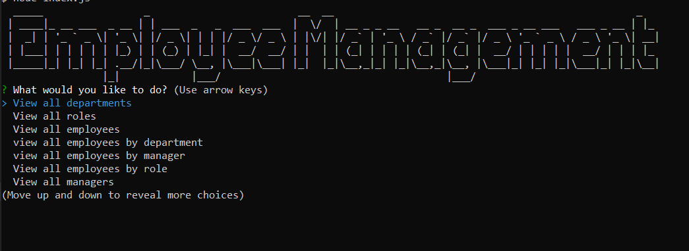

<h1 align="center">Employee Tracker Using MySQL, Inquirer, and Node.js </h1>
  
  
<p align="center">
    
    
    
    
    
    
    
    
</p>
   
## Task

Developers frequently have to create interfaces that make it easy for non-developers to view and interact with information stored in databases. These interfaces are called content management systems (CMS). Your challenge this week is to build a command-line application to manage a company's employee database, using Node.js, Inquirer, and MySQL.


  
 Below is the gif showing the functionality of the application:
  

  
## User Story
  
```
AS A business owner
I WANT to be able to view and manage the departments, roles, and employees in my company
SO THAT I can organize and plan my business
```
  
## Acceptance Criteria
  
``` 
GIVEN a command-line application that accepts user input
WHEN I start the application
THEN I am presented with the following options: view all departments, view all roles, view all employees, add a department, add a role, add an employee, and update an employee role
WHEN I choose to view all departments
THEN I am presented with a formatted table showing department names and department ids
WHEN I choose to view all roles
THEN I am presented with the job title, role id, the department that role belongs to, and the salary for that role
WHEN I choose to view all employees
THEN I am presented with a formatted table showing employee data, including employee ids, first names, last names, job titles, departments, salaries, and managers that the employees report to
WHEN I choose to add a department
THEN I am prompted to enter the name of the department and that department is added to the database
WHEN I choose to add a role
THEN I am prompted to enter the name, salary, and department for the role and that role is added to the database
WHEN I choose to add an employee
THEN I am prompted to enter the employee’s first name, last name, role, and manager and that employee is added to the database
WHEN I choose to update an employee role
THEN I am prompted to select an employee to update and their new role and this information is updated in the database 
```
  

## Installation
  
`npm init`
  
`npm install inquirer`

`npm install mysql2`
  
## Usage
  
Run the following command at the root of your project and answer the prompted questions:
  
`npm start`

## Contributor
 [Ephraim Marbloe](https://github.com/Emarbloe/employee-tracker.git)

## Questions
✉️ Contact information: [email](mailto:fephraim@gmail.com.com) , [GitHub](https://github.com/jpd61)<br />
